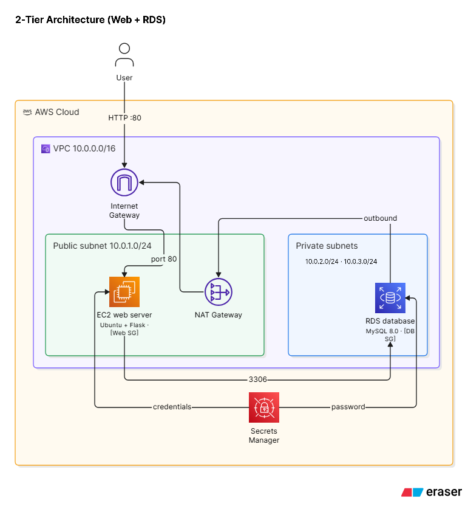

# RDS Database (Mini Project)

## Overview

A two-tier web application stack on AWS, deployed with Terraform using a modular architecture. The infrastructure includes:

- **VPC** with one public subnet and two private subnets across two Availability Zones
- **EC2 instance** running a Flask web application on Ubuntu, in the public subnet
- **RDS MySQL database** in the private subnets, not publicly accessible
- **NAT Gateway** giving the private subnets outbound-only internet access
- **Security groups** restricting database access to the web tier
- **AWS Secrets Manager** for the database password, generated once and shared with RDS and EC2

## Architecture



Traffic flow:

- **Inbound**: Users reach the EC2 web server through the Internet Gateway. The database has no public route.
- **Web to database**: The web server connects to RDS on port 3306. The database security group only accepts traffic from the web server security group.
- **Outbound from private subnets**: Each private subnet's route table sends `0.0.0.0/0` to the NAT Gateway, which sits in the public subnet and reaches the internet through the Internet Gateway. Nothing on the internet can initiate a connection into the private subnets.

## Project Structure

```
day22/
├── main.tf                          # Root module - orchestrates all modules
├── variables.tf                     # Root variables
├── outputs.tf                       # Root outputs
├── terraform.tfvars.example         # Example variable values
├── architecture.png                 # Architecture diagram
├── README.md                        # This file
└── modules/
    ├── secrets/                     # Secrets Module
    │   ├── main.tf
    │   ├── variables.tf
    │   └── outputs.tf
    ├── vpc/                         # VPC Module
    │   ├── main.tf
    │   ├── variables.tf
    │   └── outputs.tf
    ├── security_groups/             # Security Groups Module
    │   ├── main.tf
    │   ├── variables.tf
    │   └── outputs.tf
    ├── rds/                         # RDS Module
    │   ├── main.tf
    │   ├── variables.tf
    │   └── outputs.tf
    └── ec2/                         # EC2 Module
        ├── main.tf
        ├── variables.tf
        ├── outputs.tf
        └── templates/
            └── user_data.sh         # EC2 bootstrap script
```

## Prerequisites

- AWS CLI configured with credentials
- Terraform >= 1.0
- An AWS account with permissions to create VPC, EC2, RDS, NAT Gateway, Elastic IP, Security Group, and Secrets Manager resources

## Usage

### 1. Initialize Terraform

```bash
terraform init
```

### 2. Review the Plan

```bash
terraform plan
```

### 3. Deploy the Infrastructure

```bash
terraform apply
```

### 4. Access the Application

After deployment, Terraform outputs the application URL:

```bash
terraform output application_url
```

The Flask application exposes three endpoints:

- `/` - Home page
- `/health` - Database connectivity health check
- `/db-info` - Database information

### 5. Clean Up

```bash
terraform destroy
```

Destroy the stack when you are done. The NAT Gateway and RDS instance bill by the hour while they exist.

## Configuration

Override defaults by creating a `terraform.tfvars` file (copy from `terraform.tfvars.example`):

```hcl
project_name       = "my-rds-project"
environment        = "dev"
aws_region         = "us-east-1"
db_name            = "myappdb"
enable_nat_gateway = true
```

The database password is not a configuration input. The `secrets` module generates it and passes it to the RDS and EC2 modules.

| Variable | Default | Description |
|----------|---------|-------------|
| `project_name` | `day22-rds-demo` | Name prefix for resources and tags |
| `environment` | `dev` | Environment name |
| `aws_region` | `us-east-1` | AWS region |
| `vpc_cidr` | `10.0.0.0/16` | VPC CIDR block |
| `public_subnet_cidr` | `10.0.1.0/24` | Public subnet CIDR |
| `private_subnet_cidrs` | `["10.0.2.0/24", "10.0.3.0/24"]` | Private subnet CIDRs (at least 2, required by RDS) |
| `enable_nat_gateway` | `true` | Create a NAT Gateway for private subnet outbound access |
| `ec2_instance_type` | `t2.micro` | Web server instance type |
| `db_name` | `webappdb` | Database name |
| `db_username` | `admin` | Database master username |
| `db_instance_class` | `db.t3.micro` | RDS instance class |
| `db_allocated_storage` | `10` | RDS storage in GB |
| `db_engine_version` | `8.0` | MySQL engine version |

## Modules

### Secrets Module
Generates the database master password and stores it in AWS Secrets Manager. The single generated value is passed to both the RDS and EC2 modules, so the application always authenticates with the password the database was created with.

### VPC Module
Creates the network: VPC, one public subnet, two private subnets, Internet Gateway, and route tables.

**Outbound access for private subnets:** an Elastic IP and a NAT Gateway are placed in the public subnet. Each private route table has a `0.0.0.0/0` route to the NAT Gateway, so resources in the private subnets can reach the internet (for example, for OS and package updates) without being reachable from it. A single NAT Gateway serves both private subnets. Set `enable_nat_gateway = false` to skip it and avoid the cost.

### Security Groups Module
- **Web server**: allows HTTP (80) and SSH (22) from anywhere
- **Database**: allows MySQL (3306) only from the web server security group

### RDS Module
Deploys a MySQL RDS instance in the private subnets through a DB subnet group.

### EC2 Module
Deploys an Ubuntu EC2 instance in the public subnet with:

- Flask web application
- MySQL client for database connectivity
- Systemd service for application management

## Cost

The NAT Gateway is the main fixed cost, roughly $32 per month while running, plus data processing charges. The RDS instance and Elastic IP also accrue charges. Run `terraform destroy` after testing, or set `enable_nat_gateway = false` if the private tier does not need outbound access.

## Security Notes

1. SSH is open to the world (`0.0.0.0/0`). Restrict it to your own IP for anything beyond a demo.
2. The Terraform state file contains the generated database password in plaintext. Never commit `terraform.tfstate`, and use a remote backend with encryption for shared or production use.
3. RDS storage encryption is not enabled. Enable it for production workloads.
4. The demo Flask app runs the development server as root and renders submitted messages without HTML escaping. Do not reuse it as a production application.

## Troubleshooting

1. **Application not responding**: wait 2-3 minutes after deployment for the EC2 user data script to finish.
2. **Database connection errors**: verify the security group rules and confirm RDS is in the `available` state.
3. **RDS creation is slow**: RDS instances typically take 5-10 minutes to provision.
4. **NAT Gateway creation is slow**: allow 2-5 minutes for it to reach the `available` state.

## Outputs

| Output | Description |
|--------|-------------|
| `vpc_id` | ID of the created VPC |
| `web_server_public_ip` | Public IP of the EC2 instance |
| `web_server_public_dns` | Public DNS of the EC2 instance |
| `application_url` | URL to access the Flask application |
| `rds_endpoint` | RDS instance endpoint |
| `rds_port` | RDS instance port |
| `database_name` | Name of the database |
